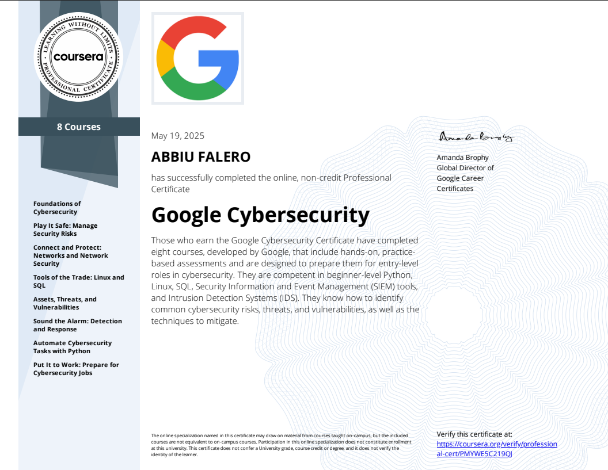
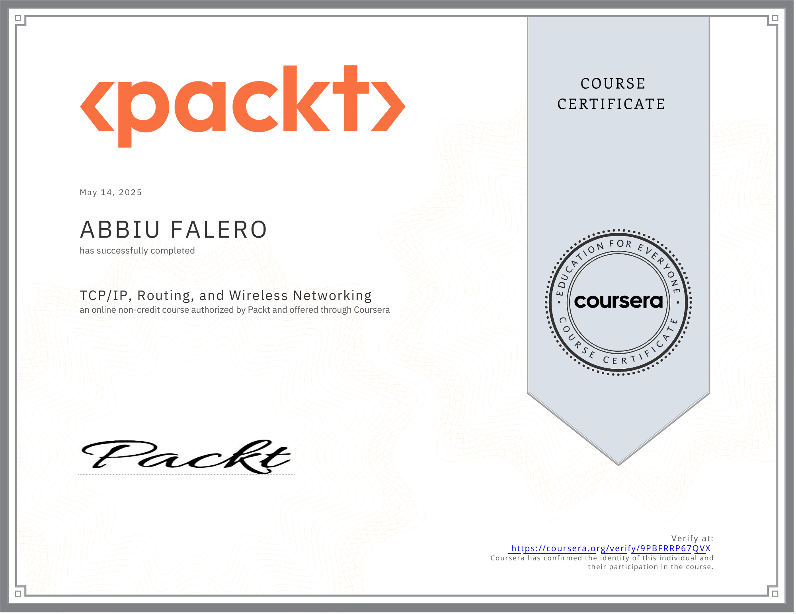

# 🛡️ Cybersecurity-Certifications

A public showcase of completed cybersecurity certifications and hands-on coursework, including the Google Cybersecurity Professional Certificate and LinkedIn Learning achievements.  
Curated by **Bobby Falero** (CyberSecFale) as part of a growing portfolio.

---

## 🎓 Certifications

### 📘 Google Cybersecurity Professional Certificate  
  
**Earned:** May 19, 2025  
_Covers Linux, SQL, SIEM tools, IDS, threat detection, and risk mitigation techniques._

---

## 🧠 Coursera Certificates (Google & Packt)

| Course Title | Completion Date | Skills Covered |
|--------------|------------------|----------------|
| Connect and Protect: Networks and Network Security | Apr 3, 2024 | Network Security, TCP/IP |
| Play It Safe: Manage Security Risks | Mar 20, 2024 | Risk Management, Security |
| Sound the Alarm: Detection and Response | Mar 12, 2025 | Threat Detection, SIEM |
| Tools of the Trade: Linux and SQL | May 6, 2024 | Linux CLI, SQL Queries |
| Automate Cybersecurity Tasks with Python | May 19, 2025 | Python, Scripting |
| Assets, Threats, and Vulnerabilities | Nov 19, 2024 | Risk Assessment |
| Networking Fundamentals and Physical Networks | May 13, 2025 | Physical Layer, LAN |
| TCP/IP, Routing, and Wireless Networking | May 14, 2025 | TCP/IP Stack, Wireless |
| Advanced Networking, Virtualization, and Security | May 15, 2025 | VLANs, Firewalls |

---

## 💼 LinkedIn Learning Certifications

| Course Title | Completion Date | Skills Covered |
|--------------|------------------|----------------|
| CompTIA Network+ (N10-009) Cert Prep | May 20, 2025 | Network Admin, Network Security |
| Cybersecurity Foundations: GRC | May 1, 2025 | Governance, Risk, Compliance |
| Certified InfoSec Manager (CISM) – Risk | Apr 22, 2025 | IT Risk Mgmt, Security Mgmt |
| International Business Foundations | Apr 22, 2025 | Global Business |
| Programming Foundations: Web Security | Apr 12, 2025 | Secure Coding, Web App Security |
| SIEM Introduction | Apr 2, 2025 | Log Correlation, Alerting |
| IT Help Desk for Beginners | Apr 1, 2025 | Support, Troubleshooting |
| WordPress Essential Training | Apr 1, 2025 | CMS, Backend Tools |
| AI for Cybersecurity | Mar 30, 2025 | AI, Cybersecurity Use Cases |
| SSL Certificates for Web Developers | Mar 28, 2025 | Web Security, SSL/TLS |
| Cybersecurity for Executives | Mar 29, 2025 | GRC, Security Awareness |
| System Administration: Backup and Recovery | May 22, 2025 | System Administration, Backup & Recovery Systems |
| Become an IT Security Specialist | June 3, 2025 | Cybersecurity, Network Security, IT Security Ops |

---

## 🖼️ Visual Sample Gallery (Click to View Full)

---

## 🧠 Combined Skills Portfolio

- **Security Operations (SIEM, IR, GRC)**
- **Network Administration (TCP/IP, Routing, Firewalls)**
- **Secure Coding & Web Development (SSL, WordPress)**
- **IT Support (Help Desk, Desktop Troubleshooting)**
- **Business & Leadership (CISM, Global Biz Foundations)**

---

> _“Study while others are sleeping. Work while others are loafing. Prepare while others are playing. Dream while others are wishing.”_  
> — William Arthur Ward
